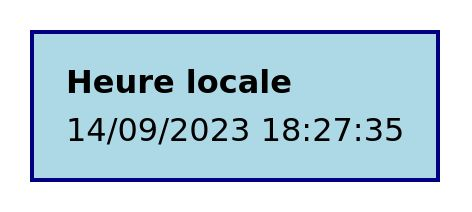
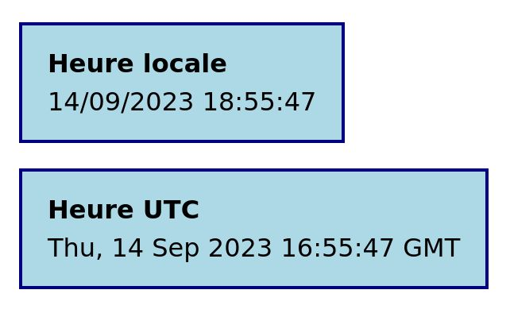

# TP Web Components

Le terme _Web Component_ regroupe trois technologies natives :

<ol>
  <li>Les <em>Custom Elements</em></li>
  <li>Le <em>Shadow DOM</em></li>
  <li>Les éléments HTML <code>&lt;template&gt;</code> et <code>&lt;slot&gt;</code> 
</ol>

Ces trois concepts seront introduits successivements par les trois exercices.

## 1. Les _Custom Elements_

Les _Custom Elements_ permettent de créer des éléments HTML sur mesure et de
définir leur contenu et leur comportement.

- Créez un fichier `index.html` avec une structure basique.
- Créez un fichier `src/current-time.js` et importez-le dans la balise `<head>`
  du fichier HTML. Utilisez l'attribut `defer` pour ne pas bloquer le parsing du
  fichier HTML.
- Ouvrez votre application dans le navigateur grâce à l'extension _Live Server_
  de _VSCode_ et vérifiez le bon lien entre les deux fichiers.

### Le composant `<current-time>`

Nous allons créer un composant affichant la date actuelle :

- Dans le fichier JavaScript, déclarez une classe `CurrentTime` qui étend la
  classe native `HTMLElement`.
- À la suite de la classe, grâce à la fonction
  `customElements.define("nom-du-tag", NomDeLaClasse)`, associez votre classe au
  tag `current-time`.
- Utilisez le tag `current-time` dans votre fichier HTML.
- Déclarez la méthode `connectedCallback` dans votre classe. Au sein de cette
  méthode, utilisez `this.innerHTML` pour ajouter du contenu à votre tag.

Le contenu doit s'afficher dans votre page.

### Affichage de l'heure

- Remplacez votre contenu de test par le vrai contenu, soit une div de classe
  `currentTime`, contenant :
  - un élément `
` de classe `currentTime__title` et contenant la chaîne
    `Heure locale` ;
  - un élément `<time>` de classe `currentTime__time`, vide.
- À la suite de cette opération, gardez une référence vers l'élément `<time>`
  dans la classe, nous en aurons besoin. Trouvez l'élément grâce à
  `this.querySelector` et stockez le dans `this.$time`.
- Insérez la date dans l'élément `<time>`. Elle peut être obtenue grâce à
  l'expression `new Date().toLocaleString()`.
- La date doit désormais s'afficher de manière statique (sans se mettre à jour).
- Ajoutez quelques styles via un fichier CSS global inclus dans `index.html`.

### Mise à jour automatique

On souhaite que la date se mette à jour à chaque seconde.

- Trouvez un moyen pour mettre à jour le contenu de `<time>` à chaque seconde
  (sans rafraîchir l'intégralité du contenu !)
- En utilisant la fonction `disconnectedCallback`, assurez-vous que la fonction
  de mise à jour ne sera plus appelée "dans le vide" après la disparition du
  composant. Pour le vérifier, vous pouvez supprimer le composant directement
  dans l'inspecteur et observer les effets (à l'aide de `console.log` par
  exemple).

### Paramètre UTC

Notre composant va désormais être capable d'accueillir un paramètre `format`. Si
ce format vaut `utc`, on souhaite afficher l'heure UTC. Pour toute autre valeur,
y compris l'absence de valeur, on reste sur le comportement initial (heure
locale).

- Dans votre HTML, ajoutez ce composant une deuxième fois, en passant cette
  fois-ci l'attribut `format="utc"`. Un deuxième composant (pour l'instant
  identique) apparaît.
- Dans votre fonction de rendu, utilisez `this.getAttribute("format")` pour
  adapter :
  - le titre du composant (`Heure UTC` ou `Heure locale`)
  - le contenu de l'élément `<time>` (`new Date().toUTCString()` ou
    `new Date().toLocaleString()`)

Les deux composants ont désormais un comportement différent !

### Prendre en compte la mise à jour de l'attribut UTC

Que se passe t-il lorsque vous inspectez le DOM et ajoutez / retirez
manuellement l'attribut `format="utc"` ?

Le format se met à jour (car il est recalculé à chaque seconde), mais pas le
titre !

Si l'on souhaite réagir aux changements d'attributs, des adaptations sont
nécessaires :

- Déclarez les attributs pris en compte par votre composant grâce à la variable
  `static observedAttributes`, qui doit être un tableau contenant le nom des
  attributs concernés.
- Grâce à la méthode `attributeChangedCallback(name, oldVal, newVal)`, lorsque
  vous détectez un changement sur l'attribut `format`, faites le nécessaire pour
  que la mise à jour soit correcte.
